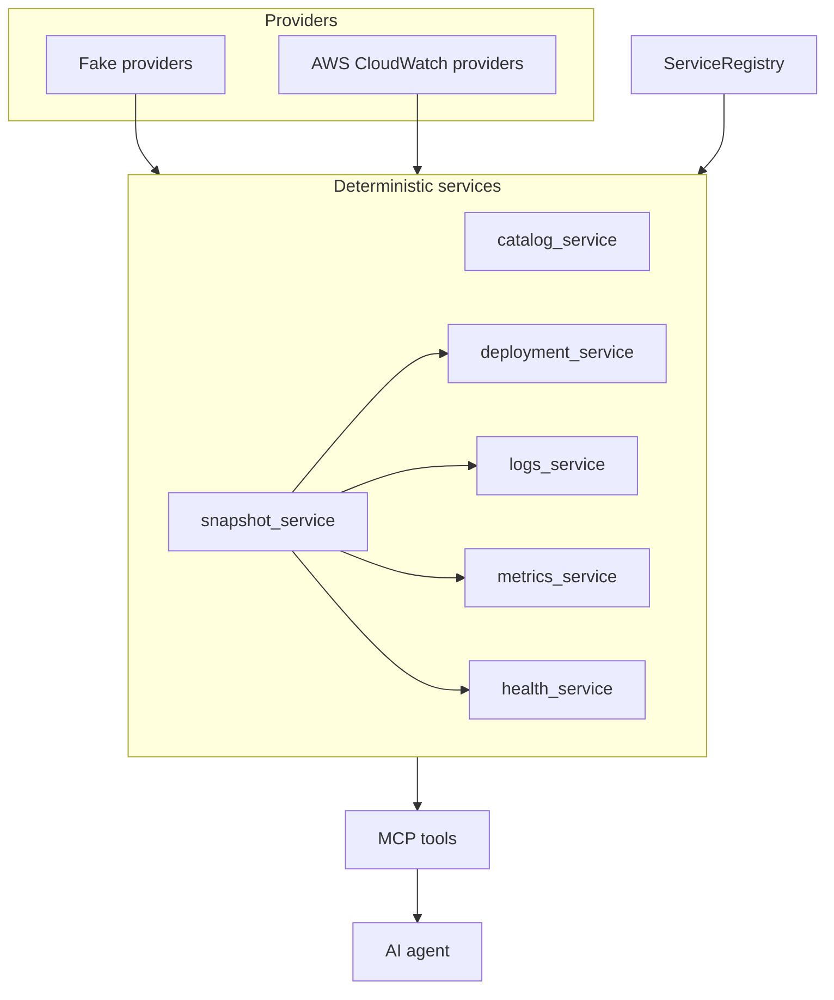

# CloudOps MCP

CloudOps MCP is a read-only [Model Context Protocol](https://modelcontextprotocol.io) server
that exposes normalized operational infrastructure context (logs, metrics, deployments,
health) to AI agents through a small set of typed, bounded tools.

## Why it exists

An agent investigating an incident needs operational context: what changed recently, what
the error rate looks like, what the logs say. It does not need unrestricted access to cloud
APIs, and it should not be the thing deciding what counts as a root cause.

CloudOps MCP sits between the two:

```
Cloud APIs / observability systems
        |
Provider adapters
        |
Normalized operational domain
        |
Deterministic services
        |
MCP tools
        |
AI agent
```

Each layer normalizes further and narrows what the agent can ask for. Provider adapters
translate vendor APIs into a shared domain model. Services apply bounds, ordering, and
aggregation deterministically, the same way for every provider. MCP tools expose that as a
small, typed surface.

CloudOps MCP returns operational facts, not root-cause conclusions. A tool can say
"error rate increased from 0.4% to 8% at 14:06"; it will not say "the deployment caused the
outage." That judgment belongs to the agent, with the facts CloudOps MCP hands it as
evidence.

## Capabilities

Six tools, all read-only and bounded:

| Tool | Purpose |
|---|---|
| `get_services` | List known services and which capabilities are configured for each. |
| `get_service_health` | Provider-reported health for a service. Never inferred from logs or metrics. |
| `get_recent_deployments` | Recent deployment events, bounded by time range and count. |
| `get_logs` | Log events, bounded by time range, count, and message length. |
| `get_metrics` | Metric series with deterministic aggregates (min/max/average/last); raw points are opt-in and bounded. |
| `get_operational_snapshot` | A composite view: recent deployments, configured snapshot metrics, recent logs, and health, in one bounded call. |

`get_operational_snapshot` composes the same primitive services the other five tools use,
running all four independent queries concurrently. It never talks to a provider directly, and
it never fails as a whole because one section is unavailable, each section reports its own
status.

## Design principles

- **Read-only by construction.** Provider interfaces expose no mutation methods. There is no
  code path to a write API.
- **Provider-neutral service identity.** A service is identified by `(service, environment)`.
  Vendor-specific identifiers (a CloudWatch log group, a Kubernetes object name) stay internal
  to provider bindings and are never part of the public contract.
- **Canonical, extensible metrics.** `error_rate`, `latency_p99`, and similar names are ours,
  not the vendor's. The mapping from a canonical name to a real metric lives in configuration,
  per service. The vocabulary is open, not a fixed enum.
- **Bounded queries.** Every telemetry query has a time-range cap and a count cap. A caller
  can ask for less; it cannot ask for unbounded data.
- **Explicit data availability.** Every collection reports one of `SUCCESS`, `EMPTY`,
  `PARTIAL`, or `FAILED`. Missing data is never silently treated as "healthy" or "nothing
  happened."
- **Availability separate from outcome.** `NOT_CONFIGURED` (no provider wired up) and
  `EMPTY` (queried successfully, zero matches) are different states and are never conflated.
- **Provenance without leaking internals.** Individual results carry `provider` and `source`
  when a provider adapter supplies them. The internal reference used to call a provider is
  never copied into public output.
- **UTC everywhere.** All timestamps are timezone-aware and normalized to UTC; naive
  datetimes are rejected at the model boundary.
- **No LLM inside the MCP server.** No summarization, no classification, no inference over
  log content. Log messages are treated as opaque, untrusted text.
- **No causal reasoning.** Tools report what changed and when. Interpreting why is left to
  the agent.

## Quick start: fake mode

Fake mode is the default and the primary way to try CloudOps MCP. It needs no cloud account.

```bash
python -m venv .venv
source .venv/bin/activate
pip install -e ".[dev]"
```

Run the server (stdio transport):

```bash
python -m cloudops_mcp.server
```

Or, if the package is installed with its console script:

```bash
cloudops-mcp
```

The server speaks MCP over stdio and expects a client on the other end. To try it directly
from Python, using the official SDK's client:

```python
import asyncio
from mcp import ClientSession, StdioServerParameters
from mcp.client.stdio import stdio_client

async def main():
    params = StdioServerParameters(command="python", args=["-m", "cloudops_mcp.server"])
    async with stdio_client(params) as (read, write):
        async with ClientSession(read, write) as session:
            await session.initialize()
            tools = await session.list_tools()
            print([t.name for t in tools.tools])

            result = await session.call_tool(
                "get_operational_snapshot",
                {"service": "checkout-api", "environment": "production"},
            )
            print(result.structured_content)

asyncio.run(main())
```

## Fake scenarios

Select a scenario with `CLOUDOPS_MCP_SCENARIO` (default `healthy`):

| Scenario | What it simulates |
|---|---|
| `healthy` | A service with every capability configured, nothing unusual. |
| `bad_deploy` | A deployment, then an error-rate and latency shift, then timeout logs. |
| `partial` | One capability failing mid-query, one not configured, the rest succeeding. |

```bash
CLOUDOPS_MCP_SCENARIO=bad_deploy python -m cloudops_mcp.server
```

`bad_deploy` seeds three correlated facts at fixed timestamps: a deployment, then a metric
shift a few minutes later, then timeout log lines shortly after that. CloudOps MCP reports
those three facts and nothing more. It does not claim the deployment caused the errors, that
inference is left entirely to the consuming agent.

## AWS CloudWatch mode

```bash
pip install -e ".[aws]"        # runtime only
pip install -e ".[dev,aws]"    # development
```

```bash
CLOUDOPS_MCP_MODE=aws CLOUDOPS_MCP_CONFIG=/path/to/cloudops.toml cloudops-mcp
```

See [`examples/aws-cloudwatch.toml`](examples/aws-cloudwatch.toml) for a complete example
config. It uses only placeholder values, no real account ID, ARN, or credential belongs in
that file.

Credentials come entirely from boto3's standard provider chain: `AWS_PROFILE`,
`AWS_REGION` / `AWS_DEFAULT_REGION`, environment credentials, or an IAM role. CloudOps MCP
never reads, stores, or logs an access key or secret.

Implemented in AWS mode:

- **Logs**: CloudWatch Logs `FilterLogEvents`.
- **Metrics**: CloudWatch `GetMetricData` (`MetricStat` queries only).

Not implemented yet: AWS-backed deployments and health. A service configured without those
sections simply reports `NOT_CONFIGURED` for them, the same as any other unconfigured
capability. See [`docs/aws.md`](docs/aws.md) for config schema, pagination behavior, and
limitations.

## AWS IAM

Minimum read-only policy for this integration (fictitious account and log group):

```json
{
  "Version": "2012-10-17",
  "Statement": [
    {
      "Effect": "Allow",
      "Action": "logs:FilterLogEvents",
      "Resource": "arn:aws:logs:us-east-1:123456789012:log-group:/aws/lambda/checkout-api"
    },
    {
      "Effect": "Allow",
      "Action": "cloudwatch:GetMetricData",
      "Resource": "*"
    }
  ]
}
```

`FilterLogEvents` can be scoped to the specific log group ARN. For the `MetricStat` queries
this integration issues, `GetMetricData` has no resource-level scoping in AWS's IAM
authorization model, so that statement uses `Resource: "*"`. That is a property of the API,
not a choice made here.

## Bounded queries

| Resource | Default | Hard cap |
|---|---|---|
| Services listed | 50 | 200 |
| Log events | 100 | 500 |
| Log message length | - | 2000 chars |
| Log/metric time range | 1 hour | 24 hours (logs), 7 days (metrics) |
| Metric points per series | - | 500 |
| Deployment events | 20 | 100 |
| Snapshot metrics per service | - | 5 |

Every bounded result reports both `requested_bounds` and `applied_bounds`, so a caller can
see exactly what was clamped. Clamping a request to the hard cap is not the same thing as
`PARTIAL`: a clamped-but-fully-satisfied query is still `SUCCESS`. `PARTIAL` means the
extraction itself is known incomplete, for example a provider paginated and stopped before
exhausting all matches within the applied window.

## Data availability semantics

Two orthogonal questions, never collapsed into one:

1. Is a capability configured for this service at all? (`CONFIGURED` / `NOT_CONFIGURED`)
2. If it was queried, what happened? (`SUCCESS` / `EMPTY` / `PARTIAL` / `FAILED`)

| State | Meaning |
|---|---|
| `NOT_CONFIGURED` | No provider is wired up for this capability. No query was attempted. |
| `EMPTY` | The provider was queried, extraction was exhausted, and there were no matches. |
| `SUCCESS` | The provider was queried and returned a complete result. |
| `PARTIAL` | Extraction is known incomplete. Data may or may not be present, for example every page scanned so far was empty but more pages exist. |
| `FAILED` | The provider was queried and the call itself failed (timeout, auth error, rate limit). |

A health check for a service with no health provider configured is `NOT_CONFIGURED`, not
`EMPTY` and not `FAILED`. A log query that legitimately found nothing in the time window is
`EMPTY`, not `FAILED`. A metrics call that hit a rate limit before returning anything usable
is `FAILED` with a reason, not silently empty data.

## Structured MCP outputs

Every tool takes typed arguments and returns a typed Pydantic model. The official Python MCP
SDK derives `structuredContent` and the tool's output schema directly from that return type,
tool responses are real structured data, not a JSON string wrapped in a text block.

## Architecture



`get_operational_snapshot` composes the primitive services, it does not bypass them or talk
to providers on its own. See [`docs/architecture.md`](docs/architecture.md) for the full
technical breakdown.

## Testing

- Deterministic fake scenarios exercise the full tool surface end to end.
- Provider-layer tests use deliberately misbehaving stub providers (wrong ordering, ignored
  bounds) to prove the service layer defends the output itself, not just well-behaved
  providers.
- AWS provider tests use small stub CloudWatch clients, no real AWS calls, no moto, no
  LocalStack.
- One test drives the real MCP SDK client against an in-process server, confirming the
  protocol boundary itself (tool discovery, structured output) rather than only internal
  logic.

```bash
ruff check src tests
mypy src tests --strict
pytest -q
```

## Current limitations

- AWS live validation has been done with typed config parsing, stubbed client tests, and the
  real MCP client/server boundary, not yet against a real AWS account. That requires
  user-selected resources and is intentionally not automated: CloudOps MCP does not discover
  or probe an account on its own.
- No AWS-backed deployments or health provider yet.
- stdio transport only, no remote MCP.
- The service registry is static and configuration-backed, there is no automatic discovery
  of services from a cloud account.
- No mutation, remediation, or write path of any kind.

## Roadmap

- Additional read-only capabilities on existing providers.
- A second real provider, to pressure-test the normalization boundary against more than one
  vendor.
- A remote transport, if a deployment scenario actually needs one.
- Consumption by incident-response agents, as one example of a generic MCP client. CloudOps
  MCP is not coupled to any specific consumer.

## Security

- No mutation methods anywhere in the provider interfaces.
- No shell execution, no cloud CLI subprocess calls.
- Least-privilege IAM: exactly `logs:FilterLogEvents` and `cloudwatch:GetMetricData`, nothing
  requested "just in case."
- Standard AWS credential chain only, no custom credential handling.
- Internal provider references (log group names, CloudWatch dimensions) never appear in tool
  output.
- Log content is treated as untrusted, opaque text: never parsed, executed, or interpreted.
- Unexpected failures are sanitized at the tool boundary; only a fixed, generic message
  crosses it, never a raw exception string.
- Every telemetry query is bounded, protecting both provider APIs and the agent's context
  window.

## License

MIT, see [LICENSE](LICENSE).
